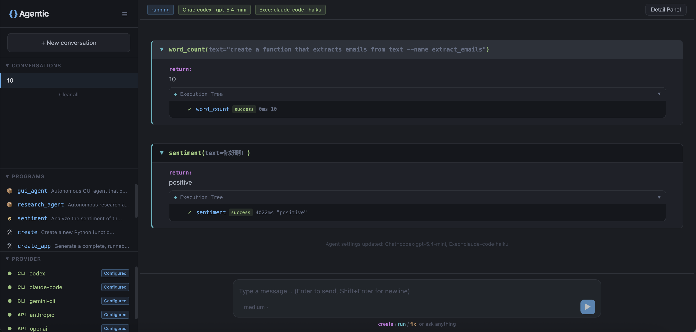
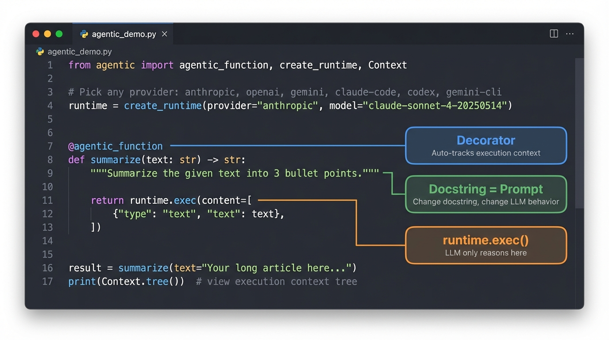

<p align="center">
  
</p>

<p align="center">The Open Source Agent Harness Framework. Any LLM. Any platform. Agentic Programming Paradigm.</p>

<p align="center">
  <a href="https://pypi.org/project/openprogram/"></a>
  <a href="https://github.com/Fzkuji/OpenProgram/blob/main/LICENSE"></a>
  <a href="https://www.python.org/"></a>
</p>

<p align="center">
  <a href="docs/GETTING_STARTED.md">Getting Started</a> &middot;
  <a href="docs/API.md">API Reference</a> &middot;
  <a href="docs/philosophy/agentic-programming.md">Philosophy</a> &middot;
  <a href="docs/README_CN.md">中文</a>
</p>

---

> **Built on the Agentic Programming paradigm.** Current LLM agent frameworks let the LLM control everything — what to do, when, and how. The result? Unpredictable execution, context explosion, and no output guarantees. OpenProgram flips this: **Python controls the flow, LLM only reasons when asked.** See [philosophy](docs/philosophy/agentic-programming.md) for the full rationale.

<p align="center">
  
</p>

## Quick Start

### Prerequisites

Agentic Programming requires at least one LLM provider. Set up any one:

| Provider | Setup |
|----------|-------|
| Claude Code CLI | `npm i -g @anthropic-ai/claude-code && claude login` |
| Codex CLI | `npm i -g @openai/codex && codex auth` |
| Gemini CLI | `npm i -g @google/gemini-cli` |
| Anthropic API | `export ANTHROPIC_API_KEY=...` |
| OpenAI API | `export OPENAI_API_KEY=...` |
| Gemini API | `export GOOGLE_API_KEY=...` |

Then choose how you want to use it:

### Option A: Python — write agentic code

Install the package and start coding:

```bash
pip install openprogram                   # core package (pure Python, no deps)
pip install "openprogram[all]"            # everything: providers + web UI + GUI harness
# …or pick what you need:
pip install "openprogram[openai]"         #   just the OpenAI SDK  (also [anthropic], [gemini])
pip install "openprogram[web]"            #   just the web UI
pip install "openprogram[gui]"            #   GUI-Agent-Harness deps (opencv / torch / ultralytics — ~2GB)
```

```python
from openprogram import agentic_function, create_runtime

# Auto-detects the best available provider (checks API keys and CLIs)
runtime = create_runtime()
# Or be explicit: create_runtime(provider="anthropic", model="claude-sonnet-4-20250514")

@agentic_function
def summarize(text):
    """Summarize the given text into 3 bullet points."""
    return runtime.exec(content=[
        {"type": "text", "text": f"Summarize this into 3 bullet points:\n{text}"},
    ])

result = summarize(text="Agentic Programming is a paradigm where ...")
print(result)
```

### Option B: Skills — let your LLM agent use it

```bash
pip install openprogram
openprogram install-skills                # auto-detects Claude Code / Gemini CLI
```

Or manually:

```bash
git clone https://github.com/Fzkuji/OpenProgram.git
cp -r OpenProgram/skills/* ~/.claude/skills/    # Claude Code
cp -r OpenProgram/skills/* ~/.gemini/skills/    # Gemini CLI
```

Then talk to your agent: *"Create a function that extracts emails from text"*

The agent picks up the skill, calls `openprogram create`, and the generated function handles everything from there.

Verify your setup with `openprogram providers`.

### Option C: Web UI

A browser-based interface for running functions, managing conversations, and viewing execution trees in real time.

```bash
pip install "openprogram[web]"
openprogram web
```

This opens `http://localhost:8765` with a chat interface where you can create, run, and fix functions interactively. Supports light/dark themes (Settings → General).

### Provider configuration at a glance

`create_runtime()` auto-detects the first available provider in this order:

1. Claude Code CLI (`claude`)
2. Codex CLI (`codex`)
3. Gemini CLI (`gemini`)
4. Anthropic API (`ANTHROPIC_API_KEY`)
5. OpenAI API (`OPENAI_API_KEY`)
6. Gemini API (`GOOGLE_API_KEY` or `GOOGLE_GENERATIVE_AI_API_KEY`)

You can always override detection explicitly:

```python
from openprogram import create_runtime

runtime = create_runtime(provider="openai", model="gpt-5")
# or: provider="anthropic" | "gemini" | "claude_code" | "codex" | "gemini_cli"
```

To inspect what the library can see on your machine:

```bash
openprogram providers
```

### Retry and recovery

Transient provider failures are handled at the `Runtime` layer, so you can retry just the LLM call instead of restarting the whole workflow:

```python
from openprogram import Runtime

runtime = Runtime(call=my_llm_call, max_retries=3)
```

`max_retries` counts the total number of attempts, including the first call. In other words:

- `max_retries=1` means try once, then fail immediately
- `max_retries=2` means first call + one retry
- `max_retries=3` means first call + up to two retries

The retry loop is designed for transient provider failures such as rate limits, flaky network requests, and temporary upstream errors. `TypeError` and `NotImplementedError` are treated as implementation errors and are raised immediately instead of being retried.

Retry attempts are recorded in the execution tree, so `context.traceback()` and `context.save("trace.jsonl")` preserve the full failure history:

```python
[
    {"attempt": 1, "reply": None, "error": "ConnectionError: timeout"},
    {"attempt": 2, "reply": "ok", "error": None},
]
```

That retry history also feeds into `fix()`, which means a later repair pass can see what actually failed instead of guessing from scratch.

### `fix()` for broken generated functions

When a generated function fails, `fix()` uses the function source plus recent error context to rewrite it:

```python
from openprogram.programs.functions.meta import create, fix

extract_emails = create("Extract all emails from text as a JSON array", runtime=runtime)

try:
    extract_emails(text="Contact us at hello@example.com")
except Exception:
    extract_emails = fix(
        fn=extract_emails,
        runtime=runtime,
        instruction="Always return valid JSON array output.",
    )
```

Internally this runs a clarify → generate → verify loop, which makes it a good fit for tightening output formats after real failures instead of regenerating from scratch.

A few practical details matter:

- `fix()` can inspect the function source, function name, and recent `Context` failure history
- if retries already happened, those recorded attempts become part of the repair context
- if the verifier never accepts a rewrite within `max_rounds`, `fix()` returns a summary string instead of raising
- if more information is needed and no `ask_user` handler is installed, it can return a follow-up payload like `{"type": "follow_up", "question": "..."}`

Use `Runtime(max_retries=...)` for transient API problems, and `fix()` for structural problems in the generated function itself. They complement each other rather than overlapping.

---

## Why Agentic Programming?

<p align="center">
  
</p>

| Principle | How |
|-----------|-----|
| **Deterministic flow** | Python controls `if/else/for/while`. Execution is guaranteed, not suggested. |
| **Minimal LLM calls** | Call the LLM only when reasoning is needed. 2 calls, not 10. |
| **Docstring = Prompt** | Change the docstring, change the LLM's behavior. No separate prompt files. |
| **Self-evolving** | Functions generate, fix, and improve themselves at runtime. |

<details>
<summary><strong>The problem with current frameworks</strong></summary>

<p align="center">
  
</p>

Current LLM agent frameworks place the LLM as the central scheduler. This creates three fundamental problems:

- **Unpredictable execution** — the LLM may skip, repeat, or invent steps regardless of defined workflows
- **Context explosion** — each tool-call round-trip accumulates history
- **No output guarantees** — the LLM interprets instructions rather than executing them

The core issue: **the LLM controls the flow, but nothing enforces it.** Skills, prompts, and system messages are suggestions, not guarantees.

</details>

|  | Tool-Calling / MCP | Agentic Programming |
|--|---------------------|---------------------|
| **Who schedules?** | LLM decides | Python decides |
| **Functions contain** | Code only | Code + LLM reasoning |
| **Context** | Flat conversation | Structured tree |
| **Prompt** | Hidden in agent config | Docstring = prompt |
| **Self-improvement** | Not built-in | `create` → `fix` → evolve |

MCP is the *transport*. Agentic Programming is the *execution model*. They're orthogonal.

---

## Key Features

<p align="center">
  
</p>

### Automatic Context

Every `@agentic_function` call creates a **Context** node. Nodes form a tree that is automatically injected into LLM calls:

```
login_flow ✓ 8.8s
├── observe ✓ 3.1s → "found login form at (200, 300)"
├── click ✓ 2.5s → "clicked login button"
└── verify ✓ 3.2s → "dashboard confirmed"
```

When `verify` calls the LLM, it automatically sees what `observe` and `click` returned. No manual context management.

### Deep Work — Autonomous Quality Loop

For complex tasks that demand sustained effort and high standards, `deep_work` runs an autonomous plan-execute-evaluate loop until the result meets the specified quality level:

```python
from openprogram.programs.functions.buildin.deep_work import deep_work

result = deep_work(
    task="Write a survey on context management in LLM agents.",
    level="phd",        # high_school → bachelor → master → phd → professor
    runtime=runtime,
)
```

The agent clarifies requirements upfront, then works fully autonomously — executing, self-evaluating, and revising until the output passes quality review. State is persisted to disk, so interrupted work resumes where it left off.

### Self-Evolving Code

Functions can generate new functions, fix broken ones, and scaffold complete apps — all at runtime:

```python
from openprogram.programs.functions.meta import create, create_app, fix

# Generate a function from description
sentiment = create("Analyze text sentiment", runtime=runtime, name="sentiment")
sentiment(text="I love this!")  # → "positive"

# Generate a complete app (runtime + argparse + main)
create_app("Summarize articles from URLs", runtime=runtime, name="summarizer")
# → openprogram/programs/applications/summarizer.py

# Fix a broken function — auto-reads source & error history
# Runs a clarify → generate → verify loop (up to max_rounds=5 by default)
fixed = fix(fn=broken_fn, runtime=runtime, instruction="return JSON, not plain text")
```

The `create → run → fail → fix → run` cycle means programs improve themselves through use.

## Ecosystem

Agentic Programming ships with two built-in apps under `openprogram/programs/applications/`:

| App | Description |
|-----|-------------|
| [GUI&nbsp;Agent&nbsp;Harness](https://github.com/Fzkuji/GUI-Agent-Harness) | Autonomous GUI agent that operates desktop apps via vision + agentic functions. Python controls observe→plan→act→verify loops; the LLM only reasons when asked. |
| [Research&nbsp;Agent&nbsp;Harness](https://github.com/Fzkuji/Research-Agent-Harness) | Autonomous research agent: literature survey → idea → experiments → paper writing → cross-model review. Full pipeline from topic to submission-ready paper. |

## API Reference

### Core

| Import | What it does |
|--------|-------------|
| `from openprogram import agentic_function` | Decorator. Records execution into Context tree |
| `from openprogram import Runtime` | LLM runtime. `exec()` calls the LLM with auto-context |
| `from openprogram import Context` | Execution tree. `tree()`, `save()`, `traceback()` |
| `from openprogram import create_runtime` | Create a Runtime with auto-detection or explicit provider (`create_runtime()` checks API keys and CLIs in priority order) |

### Meta Functions

| Import | What it does |
|--------|-------------|
| `from openprogram.programs.functions.meta import create` | Generate a new `@agentic_function` from description |
| `from openprogram.programs.functions.meta import create_app` | Generate a complete runnable app with `main()` |
| `from openprogram.programs.functions.meta import fix` | Fix broken functions via multi-round LLM analysis (clarify → generate → verify loop, up to `max_rounds`) |
| `from openprogram.programs.functions.meta import create_skill` | Generate a SKILL.md for agent discovery |

### Built-in Functions

| Import | What it does |
|--------|-------------|
| `from openprogram.programs.functions.buildin.deep_work import deep_work` | Autonomous plan-execute-evaluate loop with quality levels |
| `from openprogram.programs.functions.buildin.agent_loop import agent_loop` | General-purpose autonomous agent loop |
| `from openprogram.programs.functions.buildin.general_action import general_action` | Give the LLM full freedom to complete a single task |
| `from openprogram.programs.functions.buildin.wait import wait` | LLM decides how long to wait based on context |

### Providers

Six built-in providers: Anthropic, OpenAI, Gemini (API), Claude Code, Codex, Gemini (CLI). All CLI providers maintain **session continuity** across calls. See [Provider docs](docs/api/providers.md) for details.

### API Docs by Topic

- [agentic_function](docs/api/agentic_function.md) — decorator behavior, context injection, auto-save
- [Runtime](docs/api/runtime.md) — `exec()`, retries, response formats, provider wiring
- [Context](docs/api/context.md) — execution tree, `tree()`, `save()`, traceback views
- [Meta Functions](docs/api/meta_function.md) — `create()`, `create_app()`, `fix()`, `create_skill()`
- [Providers](docs/api/providers.md) — built-in runtimes, detection order, CLI vs API tradeoffs

## Integration

| Guide | Description |
|-------|-------------|
| [Getting Started](docs/GETTING_STARTED.md) | 3-minute setup and runnable examples |
| [Claude Code](docs/INTEGRATION_CLAUDE_CODE.md) | Use without API key via Claude Code CLI |
| [OpenClaw](docs/INTEGRATION_OPENCLAW.md) | Use as OpenClaw skill |
| [API Reference](docs/API.md) | Full API documentation |

<details>
<summary><strong>Project Structure</strong></summary>

```
agentic/
├── __init__.py              # agentic_function, Runtime, Context, create_runtime
├── function.py              # @agentic_function decorator
├── runtime.py               # Runtime (exec + retry + context injection)
├── context.py               # Context tree
├── meta_functions/          # Self-evolving code generation
│   ├── create.py            #   create() — generate a function
│   ├── create_app.py        #   create_app() — generate a complete app
│   ├── fix.py               #   fix() — rewrite broken functions
│   └── create_skill.py      #   create_skill() — generate SKILL.md
├── providers/               # Anthropic, OpenAI, Gemini, Claude Code, Codex, Gemini CLI
├── mcp/                     # MCP server (python -m openprogram.mcp)
├── functions/               # Built-in agentic functions
│   ├── deep_work.py         #   Autonomous quality loop
│   ├── agent_loop.py        #   General agent loop
│   ├── general_action.py    #   Single-task action
│   └── wait.py              #   Context-aware waiting
└── apps/                    # built-in & generated apps
    ├── GUI-Agent-Harness/   #   autonomous GUI agent (pre-installed)
    └── Research-Agent-Harness/ # autonomous research agent (pre-installed)
skills/                      # SKILL.md files for agent integration
examples/                    # runnable demos
tests/                       # pytest suite
```

</details>

## Contributing

This is a **paradigm proposal** with a reference implementation. We welcome discussions, alternative implementations in other languages, use cases that validate or challenge the approach, and bug reports.

See [CONTRIBUTING.md](CONTRIBUTING.md) for details.

## License

MIT
