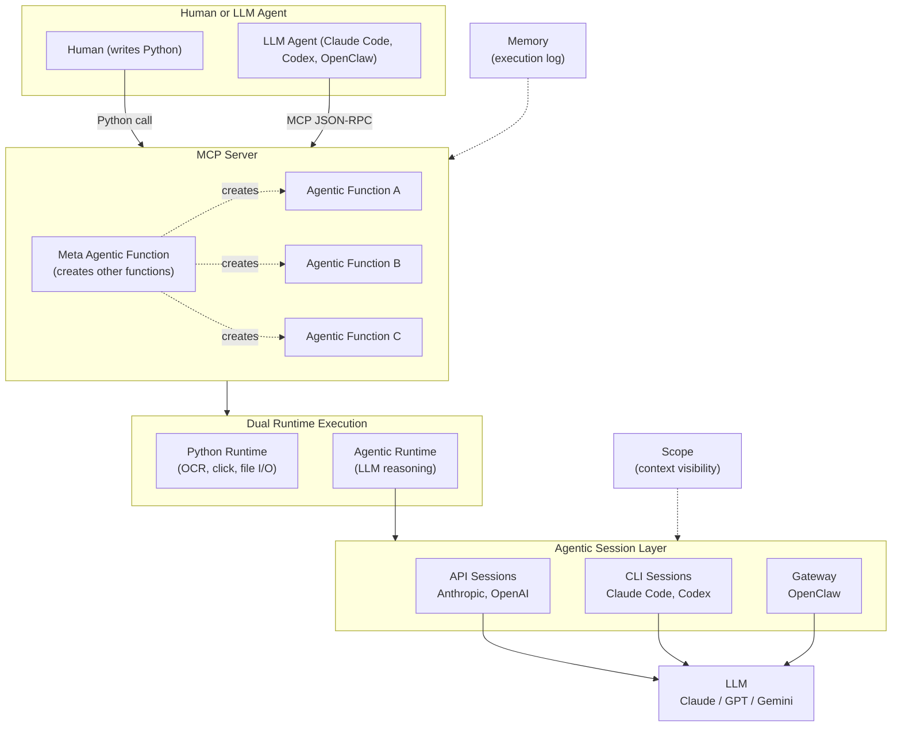
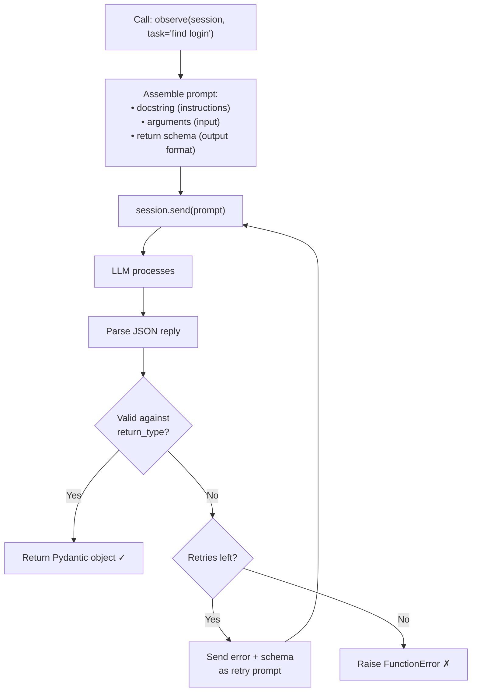
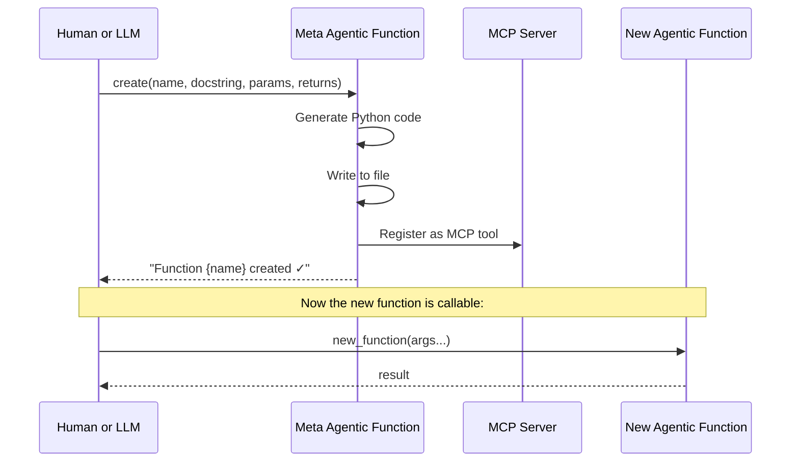
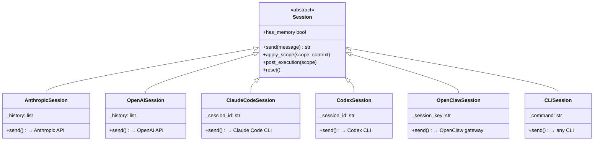
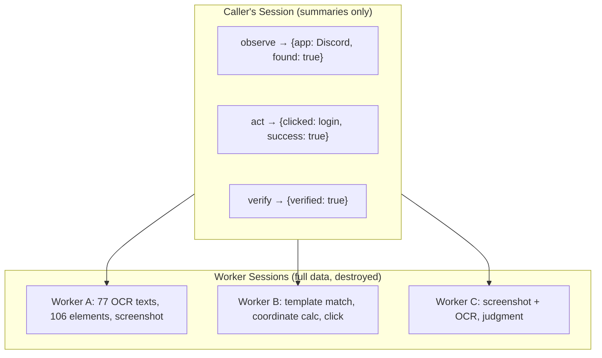
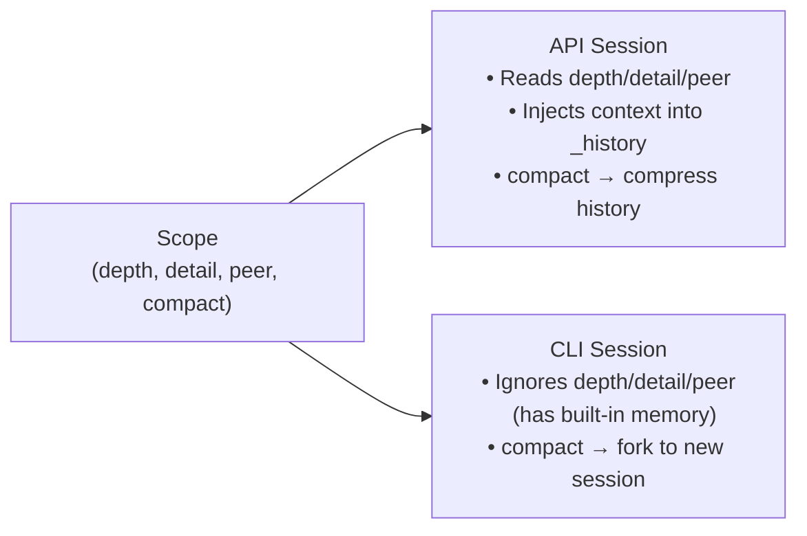
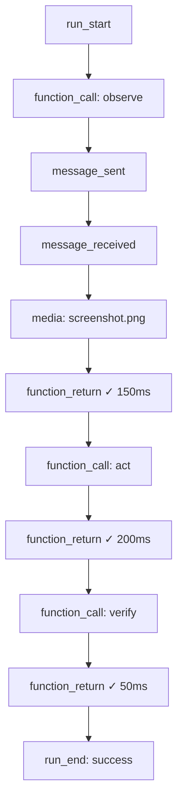
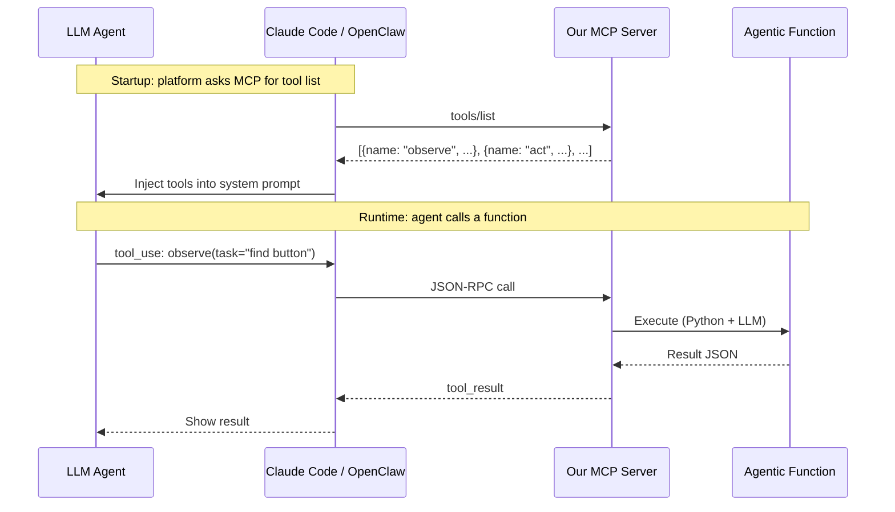
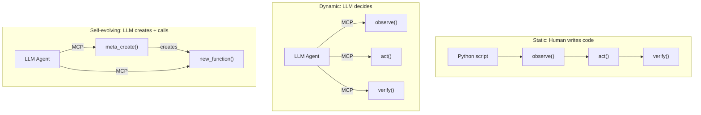
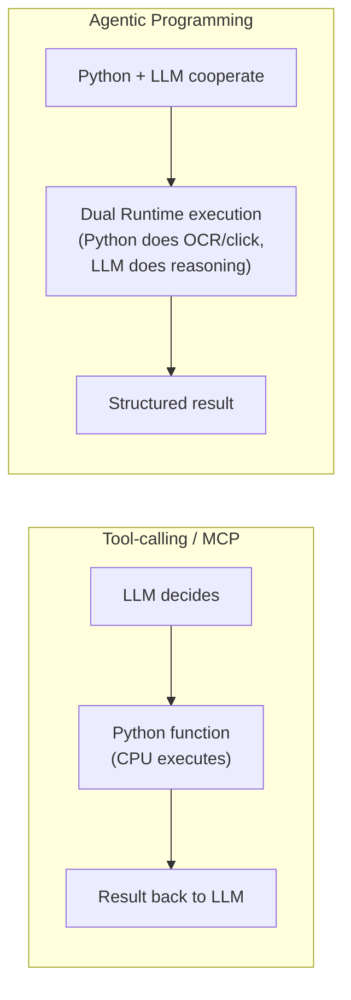

# Agentic Programming — Design Specification

> A programming paradigm where LLM and Python co-execute functions.

---

## 1. Core Concepts

The entire framework has only two concepts:

| Concept | Definition |
|---------|-----------|
| **Agentic Function** | A function executed by Python Runtime + Agentic Runtime together. Docstring = prompt. |
| **Meta Agentic Function** | An Agentic Function that creates other Agentic Functions. The bootstrap point of the system. |

Everything else is infrastructure:

| Infrastructure | Purpose |
|----------------|---------|
| **Agentic Session** | Interface to the Agentic Runtime (LLM). Manages history, context, images. |
| **Agentic Scope** | Controls what a Session can see (context visibility). |
| **Agentic Memory** | Persistent execution log (calls, results, media). |
| **Agentic Type** | Pydantic model that guarantees output format. |
| **MCP Server** | Single entry point — all functions registered as MCP tools. |

---

## 2. Architecture Overview



---

## 3. Agentic Function

### What is it?

A Python function whose logic is split between two Runtimes:
- **Python Runtime**: deterministic code (screenshots, OCR, detection, clicking)
- **Agentic Runtime**: LLM reasoning (understanding, finding targets, deciding)

The **docstring IS the prompt**. Change the docstring → change the behavior.

### Execution Flow



### Dual Runtime Cooperation

```python
def observe(programmer, task: str) -> ObserveResult:
    """Look at the screen and find all visible UI elements."""

    # ── Python Runtime (deterministic) ──
    screenshot = take_screenshot()        # Python: capture screen
    ocr_data = run_ocr(screenshot.path)   # Python: extract text
    elements = detect_all(screenshot.path) # Python: detect UI elements

    # ── Agentic Runtime (reasoning) ──
    worker = create_session(model="sonnet")
    reply = worker.send({
        "text": f"Analyze this screen. Task: {task}\nOCR: {ocr_data}\nElements: {elements}",
        "images": [screenshot.path]
    })

    # ── Python Runtime (parse + validate) ──
    result = ObserveResult.parse(reply)
    return result
```

### Two Ways to Define

**With decorator** (recommended):

```python
@function(return_type=ObserveResult)
def observe(session: Session, task: str) -> ObserveResult:
    """Look at the screen and find all visible UI elements.
    Check if the target described in 'task' is visible."""
```

**Manual** (full control over both Runtimes):

```python
def observe(session: Session, task: str) -> ObserveResult:
    screenshot = take_screenshot()  # Python Runtime
    reply = session.send(...)       # Agentic Runtime
    return ObserveResult.parse(reply)
```

### Built-in Functions

| Function | Input | Output | Description |
|----------|-------|--------|-------------|
| `ask` | question | str | Plain text Q&A |
| `extract` | text, schema | Pydantic model | Structured data extraction |
| `summarize` | text | str | Text summarization |
| `classify` | text, categories | str | Classification |
| `decide` | question, options | str | Decision making |

---

## 4. Meta Agentic Function

### What is it?

The only "hardcoded" function in the system. It creates all other Agentic Functions and registers them as MCP tools. Both humans and LLMs call it the same way.

### Why it matters

- **Self-evolving**: LLM encounters a new task → calls Meta → new function exists → reuses it
- **Unified bootstrap**: the entire system grows from this one function
- **No Programmer role needed**: any LLM agent + MCP + Meta = complete system

### How it works



### Bootstrap Sequence

```
System start:
  1. MCP Server starts with only Meta Agentic Function
  2. Human or LLM calls Meta to create domain functions
  3. Domain functions become available as MCP tools
  4. Human or LLM calls domain functions to do work

Self-evolving:
  1. LLM encounters unknown task
  2. LLM calls Meta to create a new function for it
  3. LLM calls the new function
  4. Next time, function already exists — no Meta call needed
```

---

## 5. Agentic Session

### What is it?

The interface to the Agentic Runtime (LLM). You send a message, get a reply. Sessions manage conversation history for context reuse.



### Session Types

| Session | Backend | Images | History managed by | Auth |
|---------|---------|--------|--------------------|------|
| AnthropicSession | Anthropic API | ✅ base64 | Us (`_history`) | API key |
| OpenAISession | OpenAI API | ✅ base64 | Us (`_history`) | API key |
| ClaudeCodeSession | Claude Code CLI | ✅ stream-json | CLI (`--session-id`) | Subscription |
| CodexSession | Codex CLI | ✅ `--image` | CLI (`--session-id`) | Subscription |
| OpenClawSession | OpenClaw gateway | ✅ OpenAI format | Server-side | Gateway token |
| CLISession | Any CLI command | ❌ | None (stateless) | Depends |

### Two-Layer Session Design



- **Caller's Session** grows slowly (only result summaries)
- **Worker Sessions** have full data but are destroyed after each function call
- Like Python's local variables: function returns → locals gone, only return value survives

---

## 6. Agentic Scope

### What is it?

An intent declaration for context visibility. Attached to a function, read by the Session. Each Session type handles only the parameters it understands.

### Parameters

| Parameter | Type | Read by | Description |
|-----------|------|---------|-------------|
| `depth` | Optional[int] | API Sessions | Call stack layers visible (0=none, -1=all) |
| `detail` | Optional[str] | API Sessions | "io" (summary) or "full" (reasoning) |
| `peer` | Optional[str] | API Sessions | Sibling visibility: "none", "io", "full" |
| `compact` | Optional[bool] | CLI Sessions | Compress after execution |

All parameters are **Optional**. `None` = "no opinion, use default."

### How Sessions Handle Scope



### Presets

| Preset | depth | detail | peer | Use case |
|--------|-------|--------|------|----------|
| `Scope.isolated()` | 0 | "io" | "none" | Pure function, no context |
| `Scope.chained()` | 0 | "io" | "io" | Sees sibling I/O summaries |
| `Scope.aware()` | 1 | "io" | "io" | Sees caller + siblings |
| `Scope.full()` | -1 | "full" | "full" | Sees everything |

---

## 7. Agentic Memory

### What is it?

A persistent execution log. Records every function call, result, decision, and media file during a run.

### Event Flow



### Output Format

```
logs/run_<timestamp>/
├── run.jsonl      ← Machine-readable (one JSON event per line)
├── run.md         ← Human-readable (Markdown with ✓/✗, timing, media links)
└── media/
    └── 001_screenshot.png
```

---

## 8. MCP Integration

### Why MCP?

MCP is the **transport protocol** (how to call). Agentic Programming is the **execution model** (how functions run). They are orthogonal — our functions are exposed via MCP.

### How it works



### Configuration

```json
// .mcp.json — one file, any MCP client can connect
{
  "mcpServers": {
    "gui-agent": {
      "command": "python3",
      "args": ["mcp_server.py"]
    }
  }
}
```

---

## 9. Execution Modes

| Mode | Who controls flow | How | Good for |
|------|-------------------|-----|----------|
| **Static** | Human writes Python | `observe()` → `act()` → `verify()` | Known workflows |
| **Dynamic** | LLM agent via MCP | Agent decides which tools to call | Open-ended tasks |
| **Self-evolving** | LLM + Meta Function | Agent creates new functions as needed | Unknown tasks |



---

## 10. Design Principles

| Principle | Description |
|-----------|-------------|
| **Functions are functions** | Call them, get results. No Runtime class needed. |
| **Docstring = prompt** | Change the docstring, change the behavior. |
| **Dual runtime** | Every function uses Python + LLM together. |
| **Python is the control flow** | if/for/while — not a custom DSL. |
| **Scope is intent** | Declare what you want, Session handles how. |
| **Sessions are pluggable** | Same function works with any LLM backend. |
| **Meta bootstraps everything** | One function creates the entire system. |
| **MCP is transport** | How functions are called. Orthogonal to execution. |

---

## 11. Comparison



| | Tool-calling / MCP | Agentic Programming |
|---|---|---|
| **Direction** | LLM → Python → LLM (give LLM hands) | Python + LLM → cooperate (give Python a brain) |
| **Functions contain** | Python code (CPU executes) | Docstring (Python + LLM execute) |
| **Execution** | Single runtime (CPU) | Dual runtime (Python + LLM) |
| **Context** | Implicit (one conversation) | Explicit (Agentic Scope) |
| **Self-evolving** | No | Yes (Meta Agentic Function) |
| **Prompt optimization** | Manual | Programmatic (change docstring, iterate) |

---

## 12. Project Structure

```
agentic/
├── __init__.py      Exports: agentic_function, runtime, Context, ...
├── context.py       Context: execution record + summarize() + tree/traceback/save
├── function.py      @agentic_function decorator (auto context tracking)
└── runtime.py       Agentic Runtime: runtime.exec() — LLM call + auto recording

docs/
├── DESIGN.md        This file (architecture overview)
└── CONTEXT-v3.md    Context system design (current)
```
