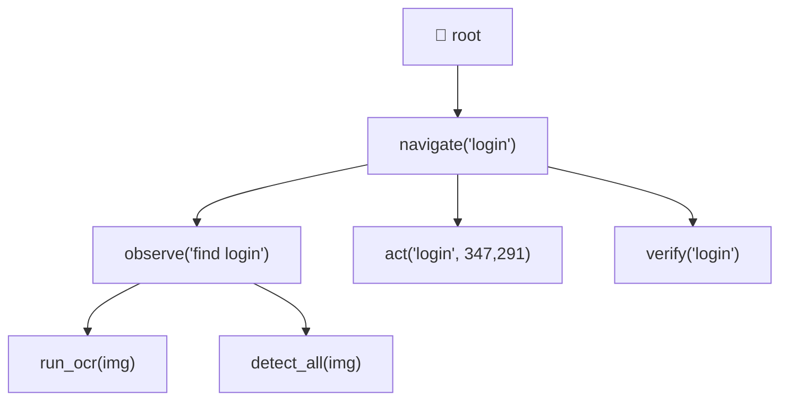
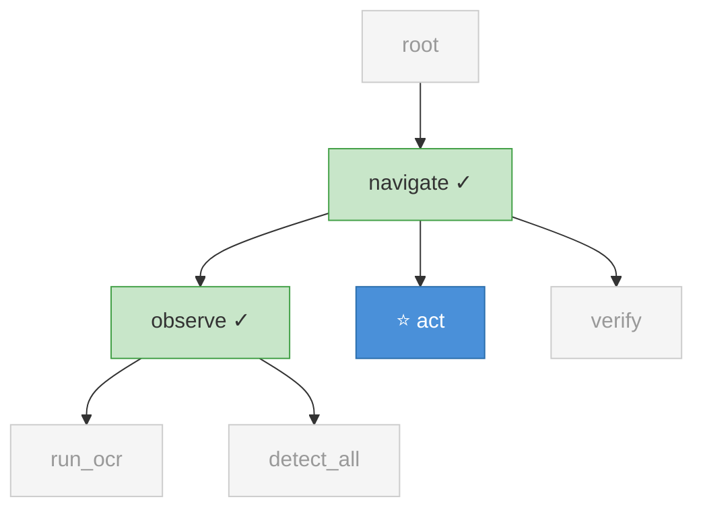
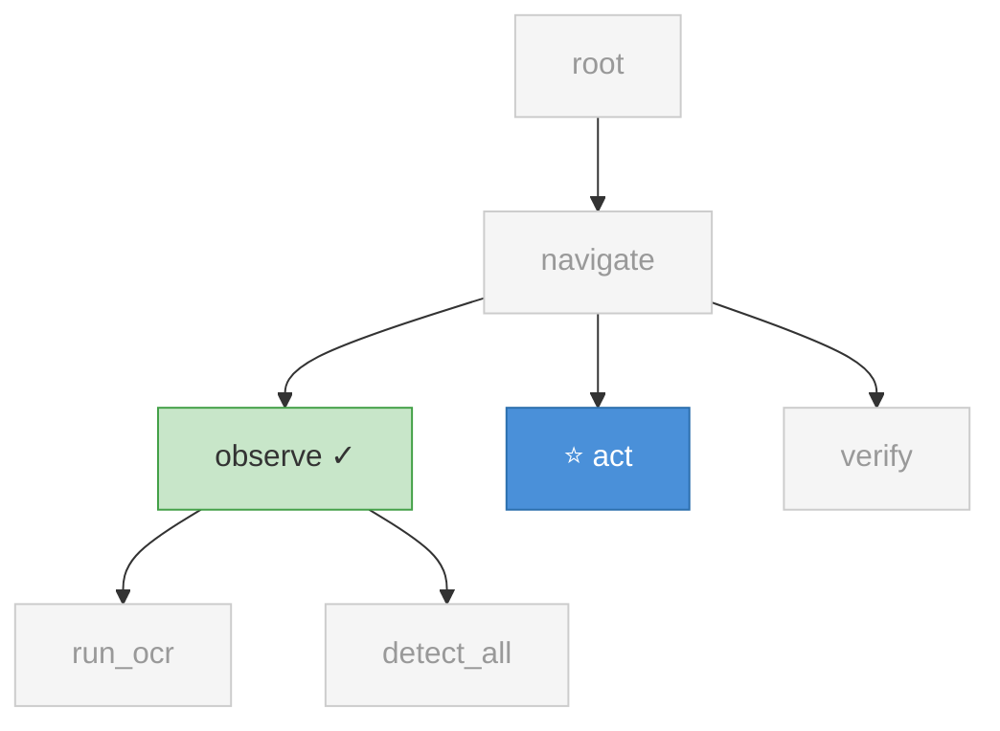
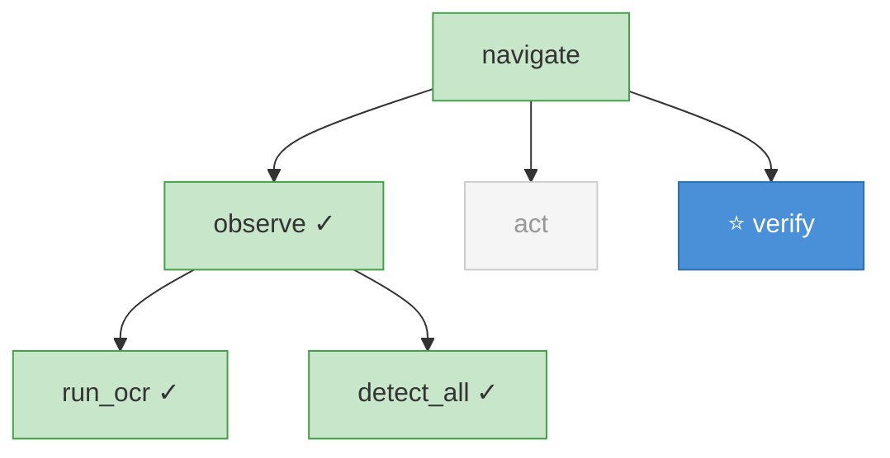
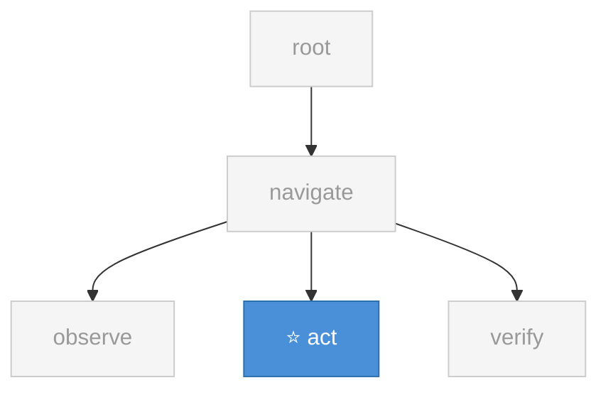
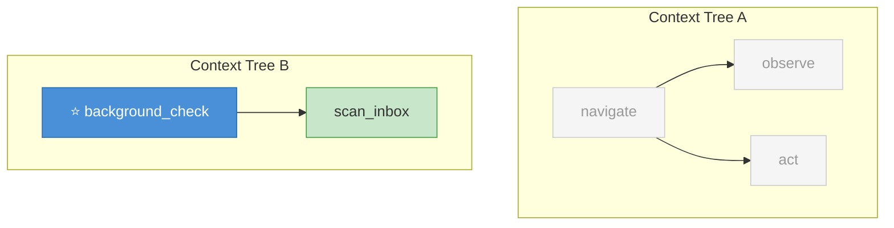
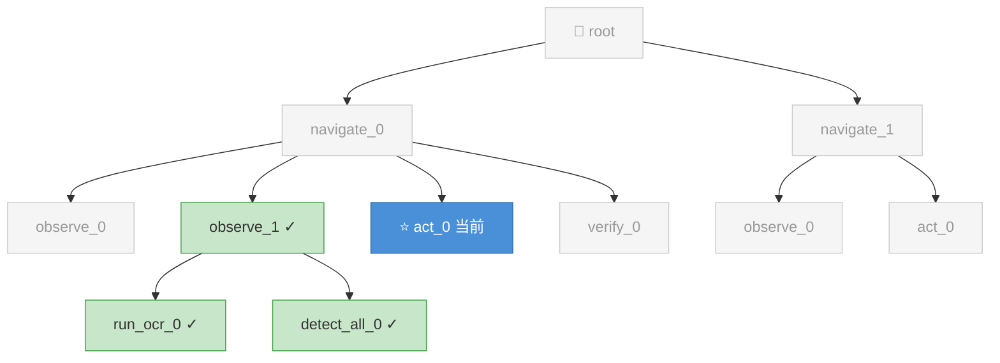

# Context Visibility — 树是完整的，视图是灵活的

Context 树永远完整记录所有调用。`summarize()` 是对树的查询 — 每个函数可以自由选择看到树的哪些部分。

---

## 完整 Context 树

所有调用都被记录，形成完整的树状结构。



[Mermaid 源文件](01-full-tree.mmd)

---

## 场景 1：depth=1 — 只看直接父和兄弟

`act` 只需要知道 `navigate` 调了它，以及前面的 `observe` 做了什么。不需要知道 `root` 或 `observe` 的子节点。

```python
ctx.summarize(depth=1)
```



🟢 绿色 = 可见 &nbsp; 🔵 蓝色 = 当前函数 &nbsp; ⬜ 灰色虚线 = 不可见

[Mermaid 源文件](02-depth-1.mmd)

---

## 场景 2：include — 只看指定节点

`act` 只想看 `observe` 的结果，其他都不要。

```python
ctx.summarize(include=["observe"])
```



[Mermaid 源文件](03-include-specific.mmd)

---

## 场景 3：branch — 看整个分支

`verify` 想看 `observe` 整个分支（包括子节点 `run_ocr` 和 `detect_all`），但不要 `act`。

```python
ctx.summarize(branch=["observe"])
```



[Mermaid 源文件](04-branch-select.mmd)

---

## 场景 4：isolated — 完全隔离

`act` 什么上下文都不看，只用自己的 prompt 和 params。

```python
ctx.summarize(depth=0, siblings=0)
# 或
@agentic_function(context="none")
```



[Mermaid 源文件](05-isolated.mmd)

---

## 场景 5：new — 独立的 Context 树

`background_check` 跟主任务完全无关，创建自己的独立树。

```python
@agentic_function(context="new")
def background_check(): ...
```



[Mermaid 源文件](06-new-tree.mmd)

---

## 完整 summarize() API

```python
ctx.summarize(
    # 纵向：祖先链
    depth=-1,                    # 往上看几层（-1=全部, 0=不看, 1=只看父）
    
    # 横向：兄弟
    siblings=-1,                 # 看几个兄弟（-1=全部, 0=不看）
    
    # 精确选择
    include=None,                # 只看这些节点（按名字）
    exclude=None,                # 排除这些节点（按名字）
    branch=None,                 # 看某个节点的整个子树
    
    # 粒度控制
    level=None,                  # 覆盖所有节点的 expose
    max_tokens=None,             # token 预算
)
```

## @agentic_function 的 context 参数

```python
@agentic_function(context="auto")      # 有父挂父，没父自动建 root（默认）
@agentic_function(context="new")       # 永远创建独立树
@agentic_function(context="inherit")   # 必须有父，没有报错
@agentic_function(context="none")      # 不创建 Context，不追踪
```

---

---

## 场景 6：路径寻址 — 精确定位任意节点

当树结构复杂、有多个同名节点时，用路径精确定位。每个 Context 节点有自动计算的路径（`ctx.path`），格式：`父路径/函数名_序号`

```python
# act 想精确看第 2 个 observe 及其子节点
ctx.summarize(include=["root/navigate_0/observe_1", "root/navigate_0/observe_1/*"])
```



路径树结构：

```
root/
├── navigate_0/
│   ├── observe_0          → root/navigate_0/observe_0
│   ├── observe_1          → root/navigate_0/observe_1
│   │   ├── run_ocr_0      → root/navigate_0/observe_1/run_ocr_0
│   │   └── detect_all_0   → root/navigate_0/observe_1/detect_all_0
│   ├── act_0              → root/navigate_0/act_0
│   └── verify_0           → root/navigate_0/verify_0
└── navigate_1/
    ├── observe_0          → root/navigate_1/observe_0
    └── act_0              → root/navigate_1/act_0
```

支持通配符：

```python
ctx.summarize(
    include=[
        "root/navigate_0/observe_1",                # 精确一个节点
        "root/navigate_0/observe_1/run_ocr_0",      # 精确子节点
        "root/navigate_1/*",                         # 某分支全部
    ]
)
```

路径不需要存储，从 parent/children 关系自动计算（`ctx.path` 是计算属性）。用户也可以自定义 id：

```python
@agentic_function(id="login_check")
def observe(task): ...
# → root/navigate_0/login_check
```

[Mermaid 源文件](07-path-addressing.mmd)

---

## 核心原则

**一棵树，记录一切。输入 LLM 时，按需查询。**

- Context 树是完整的事实记录 — 所有函数调用都挂到同一棵树上
- `summarize()` 是灵活的视图查询 — 每个函数选择看到树的哪些部分
- 记录和使用完全分离 — 记什么不受查询影响，查什么不影响记录
